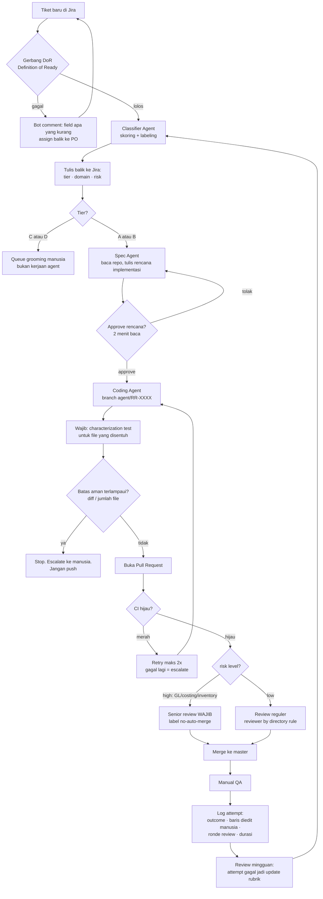

# Runchise AI Dev Pipeline — Desain Arsitektur

**Status:** draft internal Etalas · 30 Juli 2026
**Sumber data:** Jira project RR, pull 29 Juli 2026 (300 tiket To Do terbaru) + notes meeting 27 Juli
**Penulis:** Hanif (Etalas)

---

> **Koreksi 31 Juli 2026.** Bagian 0 di bawah ditulis berdasarkan spreadsheet triage, yang isinya **hanya tiket berstatus To Do** — yaitu tumpukan hal yang belum ada yang ambil. Setelah menarik data dari Jira langsung, gambarannya berbeda: tim Runchise menyelesaikan ±21,5 tiket per minggu dengan median waktu tempuh 6 hari. Mereka tidak lambat. Framing "backlog kuburan / intake rusak" di bawah terlalu keras dan harus dibaca dengan koreksi ini. Lihat `runchise-mulai-dari-sini.md` bagian 3. Yang tetap berlaku: ekor panjang yang membusuk (10% teratas >134 hari), metadata Jira yang kosong, dan desain pipeline di bagian 1–6.

## 0. Temuan yang mengubah bentuk pilot

Sebelum arsitektur, tiga angka yang harus disepakati dulu — karena ini yang nentuin desainnya.

**a. Backlog-nya kuburan, bukan gudang.**
Dari 609 tiket To Do, 309 dibuat sebelum Jun-2024 dan sudah dianggap mati. Dari 300 yang disaring, hanya **16 tiket** yang sekaligus agent-ready (Tier A/B) **dan** berumur di bawah 120 hari. Tier A/B totalnya 82, tapi 49 di antaranya berumur lebih dari 240 hari — kemungkinan besar sudah tidak relevan.

| | 0–60d | 60–120d | 120–240d | >240d | Total |
|---|---|---|---|---|---|
| Tier A | 3 | 5 | 5 | 5 | 18 |
| Tier B | 1 | 7 | 12 | 44 | 64 |
| Tier C | 16 | 5 | 16 | 89 | 126 |
| Tier D | 15 | 12 | 17 | 48 | 92 |

**b. Tiket yang paling baru justru yang paling jelek spec-nya.**
Ini temuan paling penting dan paling berlawanan dengan dugaan awal. Rasio tiket agent-ready menurun tajam makin baru tiketnya:

| Umur tiket | Tier A/B | Total | Rasio |
|---|---|---|---|
| < 30 hari | 1 | 27 | **4%** |
| < 60 hari | 4 | 35 | 11% |
| < 90 hari | 9 | 52 | 17% |
| < 120 hari | 16 | 64 | 25% |
| ≥ 240 hari | 49 | 186 | 26% |

Laju tiket masuk ±4–6 per minggu (27 tiket dalam 30 hari terakhir). Tapi dengan rasio 4–11%, dari ±12–18 tiket baru selama pilot hanya **1–2 yang agent-ready sebagaimana ditulis**.

Kenapa ini penting: artinya tiket lama terlihat lebih "siap" bukan karena kualitasnya lebih baik, tapi karena sudah pernah disentuh dan diperjelas orang. Tiket masuk dalam kondisi mentah, lalu baru rapi setelah berbulan-bulan — dan pada saat itu sudah tidak relevan lagi. Itu pola yang paling merugikan yang mungkin terjadi.

**c. Konsekuensinya: pilot queue ±16–18 tiket, dan gerbang DoR jadi penentu.**

Queue-nya praktis adalah 16 kandidat hidup itu saja. Tanpa gerbang DoR, tidak ada pasokan tiket agent-ready dari inflow — jadi gerbang itu bukan pelengkap, itu prasyarat supaya pipeline-nya punya bahan bakar setelah pilot.

Catatan risiko: 3 dari 16 kandidat (RR-7143, RR-7191, RR-7112) masuk `ACCOUNTING_LOGIC` — wajib jalur `risk:high`. Jadi queue jalur cepatnya tinggal 13.

Ini cukup untuk membuktikan loop-nya jalan. Ini **tidak cukup** untuk klaim transformasi throughput. Jadi janji ke Runchise harus digeser:

> Pilot ini bukan program pembersihan backlog. Backlog-nya sudah mati sebelum kita datang. Yang dibangun adalah **gerbang masuk + loop agent yang jalan di tiket baru**, supaya tiket yang masuk minggu depan tidak jadi tiket mati berikutnya.

Analoginya: mereka minta kita ngangkut tumpukan barang di gudang. Setelah dibuka, isinya sebagian besar sudah kedaluwarsa. Yang berguna bukan nambah kuli — tapi benerin proses penerimaan barang di pintu.

---

## 1. Prinsip desain

1. **Agent tidak pernah push ke master.** Selalu lewat PR. Tanpa pengecualian selama pilot.
2. **Review rencana dulu, bukan review diff.** Baca rencana 2 menit jauh lebih murah daripada baca diff salah arah 400 baris.
3. **Reviewer ditentukan by rule, bukan dari tiket.** 236 dari 300 tiket unassigned — tidak ada nama untuk dibaca.
4. **Blast radius nentuin ketatnya gerbang.** 78 tiket menyentuh GL/costing/inventory. Domain ini tidak boleh punya jalur cepat.
5. **Setiap attempt dicatat.** Log-nya adalah satu-satunya sumber bukti pilot. Tanpa log, tidak ada laporan Week 3.

---

## 2. Flow end-to-end

---

## 3. Rincian per stage

### Stage 0 — Gerbang Definition of Ready

Ini perbaikan dengan leverage tertinggi dan biaya paling murah. Bukan soal AI.

Aturan Jira automation: tiket tidak bisa keluar dari Backlog sebelum memenuhi:

- Deskripsi minimal 150 karakter, dengan 3 bagian: *perilaku sekarang / hasil yang diharapkan / batas scope*
- Minimal satu label domain
- Satu component terisi
- Kalau ada screenshot: wajib satu kalimat prosa per screenshot
- Kesimpulan diskusi Slack **di-paste**, bukan cuma permalink

Kenapa ini pertama: 59 tiket deskripsinya kosong, 83 tiket spec-nya cuma screenshot, 42 tiket konteksnya cuma di Slack. Agent tidak bisa membaca Slack dan tidak bisa membaca gambar sebagai spesifikasi yang bisa dieksekusi.

**Metadata yang sekarang tidak ada sama sekali:** 1 tiket punya label, 0 punya component, 0 punya priority selain Medium. Artinya router tidak punya field apa pun untuk menyaring. Label adalah hal termurah untuk dibenerin dan harus jadi pekerjaan hari pertama.

### Stage 1 — Classifier Agent

Trigger: webhook saat tiket transisi ke Ready.

Pakai model murah (Haiku-class). Skoring pakai rubrik yang sama dengan spreadsheet triage, lalu tulis balik ke Jira:

- `tier:A|B|C|D`
- `domain:reporting|inventory|gl|pos|procurement|...`
- `risk:high|low` — high kalau menyentuh GL, costing, inventory, atau apa pun yang menghasilkan angka uang

Tiket yang gagal: comment berisi **item spesifik yang kurang**, assign balik ke PO. Ini mengotomatiskan poin *"if not clear can give feedback to PO"* dari notes meeting.

### Stage 2 — Spec Agent (rencana implementasi)

Stage ini yang paling sering dilewatkan orang, dan justru yang paling nentuin.

Sebelum nulis kode: agent baca tiket + repo, lalu posting rencana sebagai komentar Jira — file mana yang disentuh, pendekatannya apa, test apa yang akan ditulis, apa yang **tidak** dikerjakan.

Manusia approve rencananya. Target baca: 2 menit.

Ini gerbang termurah di seluruh pipeline. Arah yang salah ketangkep di sini dengan biaya 2 menit, bukan di review diff dengan biaya 40 menit.

### Stage 3 — Coding Agent

- Claude Code headless, dipanggil dari runner CI. Branch `agent/RR-XXXX`, satu tiket satu branch.
- Model: Claude subscription dulu, Bedrock API key nanti (sesuai notes).
- **Wajib bawa characterization test** untuk file yang disentuh. Bukan sprint coverage terpisah — coverage naik tepat di area yang agent sering sentuh.
- **Batas aman (circuit breaker).** Kalau diff melebihi batas atau menyentuh terlalu banyak file, agent berhenti dan escalate. Tidak push. Angka batasnya ditentukan setelah audit repo; usul awal 300 baris / 8 file.

### Stage 4 — Gerbang PR

- CI wajib hijau: suite existing + test baru.
- `risk:low` + CI hijau → PR siap review reguler.
- `risk:high` → senior review wajib, label `no-auto-merge`. Tidak ada jalur cepat untuk domain uang.
- Reviewer di-assign **by directory rule** (setara CODEOWNERS), karena tiket tidak membawa nama.
- Retry CI merah maksimal 2x. Gagal lagi = escalate, jangan biarkan agent muter.
- Commit agent ditandai supaya bisa di-grep dan di-revert kalau perlu.

**Catatan penting:** seluruh Stage 4 bergantung pada CI yang ada dan hijau. Kalau CI belum ada atau flaky, desain ini runtuh dan harus dibenerin di Week 1 sebelum apa pun yang lain.

### Stage 5 — Loop umpan balik

Log per attempt: tiket, outcome, jumlah baris yang diedit manusia setelah PR dibuka, ronde review, durasi tiap stage.

Log ini bukan pelengkap — ini satu-satunya sumber angka untuk laporan Week 3. Harus jalan sejak attempt pertama.

Review mingguan: attempt yang gagal dibedah, hasilnya jadi update rubrik classifier dan aturan DoR.

---

## 4. Perbedaan dari flow di notes meeting

| Notes 27 Juli | Usul di dokumen ini | Alasan |
|---|---|---|
| `Checkout Branch → Push to Master → Manual Testing` | `Branch → PR → CI → Review → Merge → QA` | Push langsung ke master tanpa gerbang tidak bisa dipertahankan dengan 78 tiket menyentuh domain uang |
| "PR evaluation" ditaruh di Week 2 | Gerbang PR ada sejak attempt pertama | Ini gerbang keselamatan, bukan fitur peningkatan |
| Tidak ada tahap rencana | Spec Agent + approve rencana | Menangkap arah salah dengan biaya 2 menit |
| Bottleneck testing digarap terpisah | Test nempel di tiap PR agent | Coverage naik di tempat yang berguna, tanpa workstream kedua |
| Sumber tiket: backlog | Sumber tiket: inflow baru + 16 kandidat hidup | Backlog-nya sudah mati |

---

## 5. Blocker yang masih terbuka

Ketiganya belum terjawab per 30 Juli — hari ke-3 dari 21.

1. **Akses Bitbucket belum masuk.** Week 1 seharusnya audit codebase dan itu belum bisa dimulai. Ini jalur kritis.
2. **Kondisi CI & test suite belum diketahui.** Kalau CI merah atau flaky, Stage 4 tidak eksis. Harus jadi temuan pertama setelah akses masuk.
3. **Kapasitas reviewer Runchise belum dibahas.** Ini plafon throughput pilot yang sebenarnya — bukan kecepatan agent. Kalau cuma satu senior part-time, tidak ada gunanya mengejar lebih dari ±6 PR per minggu.

---

## 6. Yang perlu diputuskan Runchise minggu ini

1. Setujui gerbang DoR, dan siapa yang berwenang menolak tiket.
2. Tunjuk nama reviewer per domain + komitmen jam per minggu.
3. Setujui daftar domain `risk:high` yang wajib senior review.
4. Kerjakan pengisian label + component untuk 16 tiket kandidat (bukan 300 — cukup yang mau dipakai pilot).
5. Konfirmasi apakah 4 crash bug skor tertinggi masih hidup — bisa dicek objektif lewat Sentry, tidak perlu rapat.

---

*Angka di dokumen ini berasal dari spreadsheet triage 300 tiket. Skor tier bersifat heuristik (sinyal kata kunci dan struktur teks), bukan hasil baca manual tiap tiket — perlakukan tier sebagai urutan prioritas review, bukan putusan final.*
